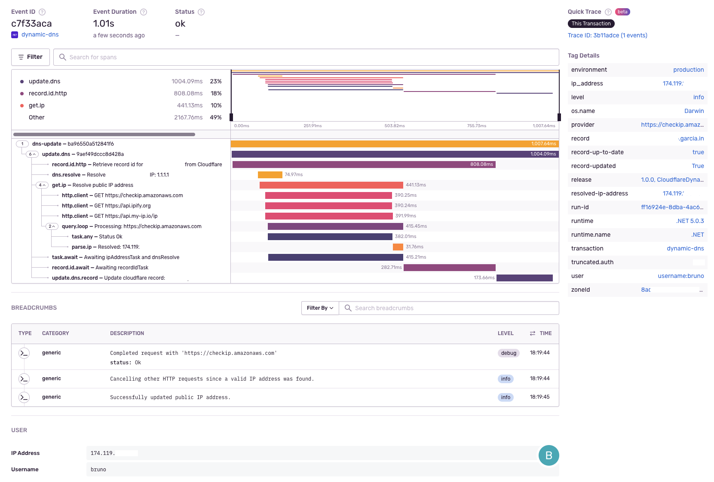
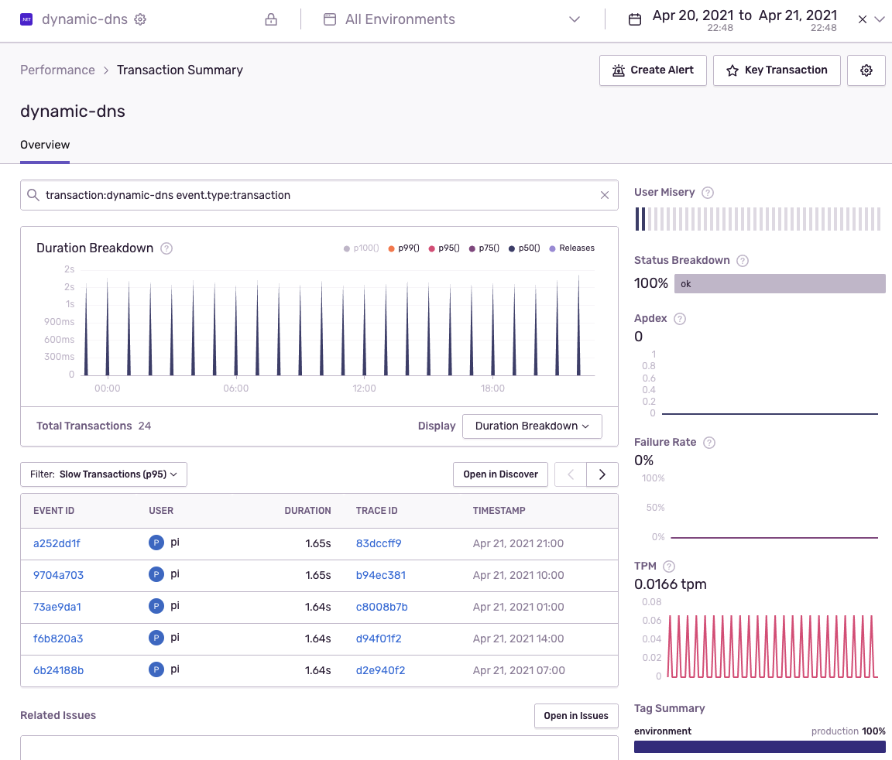
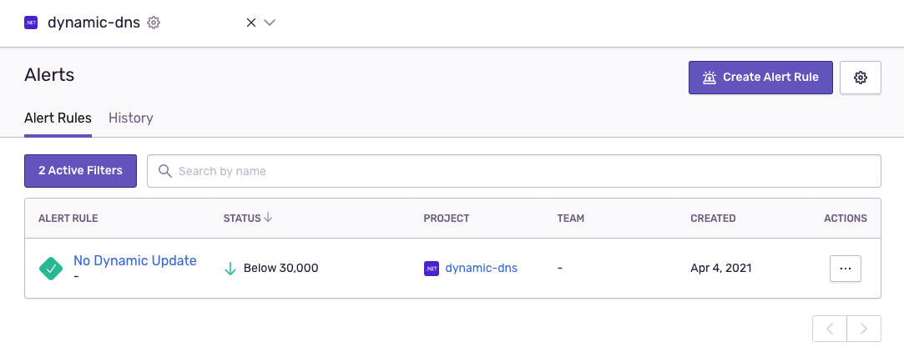
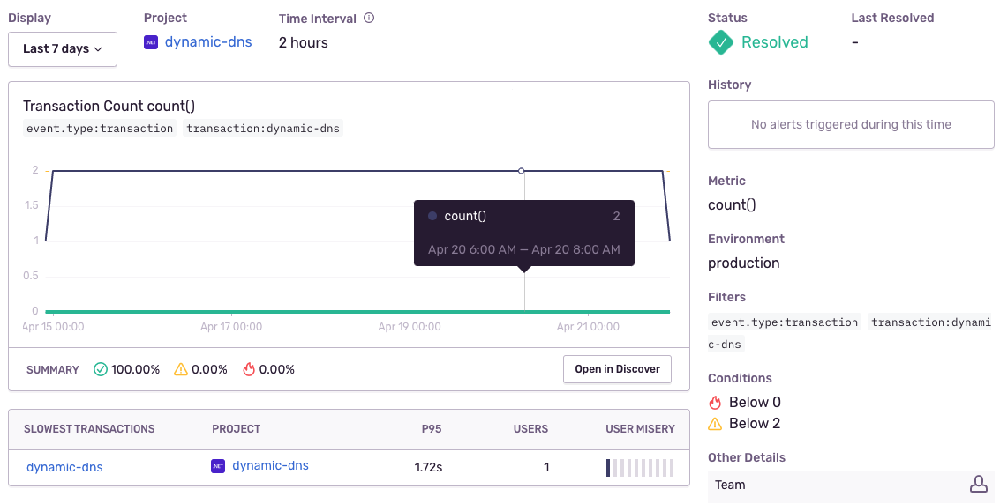

# Cloudflare Dynamic DNS updater

A tool to update a record on Cloudflare with the public IP address of the running machine.

This program hits 3 different endpoints in an attempt to find out the public facing IP address of the running machine. Using the first successful response, it updates the specified record on Cloudflare, in case it's outdated.

# Running

To run this, you'll need:

1. The binary in the release or [build from source](#Build-from-source)
2. The domain you want to change (FQDN record)
3. Cloudflare Zone Id
4. Cloudflare Auth Token
5. Optionally a [Sentry DSN](https://docs.sentry.io/product/sentry-basics/dsn-explainer/) to monitor the process

# Build from source

Install [.NET 8](http://dot.net/)

Build and publish it in release mode. These instructions describe a [self-contained](https://docs.microsoft.com/en-us/dotnet/core/deploying/#publish-self-contained) app so you don't need to install the .NET runtime in the target machine. It's just a native executable:

## Publishing self-contained

`dotnet publish -c release -r osx-x64`

Replace `osx-x64` with the [runtime identifier of the target machine](https://docs.microsoft.com/en-us/dotnet/core/rid-catalog#using-rids) you expect to run this. For example `win-x64`, `linux-x64`, etc.

A single file, compiled to that machine architecture is built.
The build prints out the publish location. For the command above, it'll be `bin/release/net5.0/osx-x64/publish/`

# Run it on Raspberry Pi

Publish it as a self contained app for Linux on `arm` (this means 32 bits! Use `arm64` if you have a 64 bit OS).

`dotnet publish -c release -r linux-arm -o publish/`

A ~10Mb file is created at: `publish/`. Copy it to the Pi:

`scp publish/CloudflareDynamicDns pi@pi.host:~/`

SSH into the Pi, and try to run it to test it out. Then and add a cron job (note that the cron entry must be on a single line):

```sh
chmod +x CloudflareDynamicDns

# Validate it works as expected.
SENTRY_DEBUG=1 \
    SENTRY_DSN=https://k@sentry.io/1 \
    ./CloudflareDynamicDns \
        zone_id \
        domain.to.update \
        cloudflare_key

# Now add to the crontab:
crontab -e

# Run every hour:
0 * * * * cd /home/pi && SENTRY_DSN=https://k@sentry.io/1 ./CloudflareDynamicDns zone_id domain.to.update cloudflare_key
```

You can check the crontab logs on syslog:

`grep CRON /var/log/syslog | tail`

Now you can [configure Sentry to raise an alert](https://docs.sentry.io/product/alerts-notifications/) if no transactions named `dynamic-dns` happen in the last N hours.

# Sentry

This project is instrumented with [Sentry](https://sentry.io). If you provide a Sentry DSN (which you can get for free on sentry.io) it will send telemetry data including crash reports and timing information about each run.

You can then configure Sentry to send alerts to you by email or other mechanism, to let you know if the job stopped working and detailed information about what went wrong.

To enable Sentry, provide a DSN via environment variable. For example:

```
SENTRY_DSN=https://963basdasdaba3a48a69378145586f70b65@o117736.ingest.sentry.io/5703176 \
    SENTRY_DEBUG=1 \
    ./CloudflareDynamicDns
```

`SENTRY_DEBUG=1` is optional, but helps when setting things up, to see what the Sentry SDK is doing.

An example transaction created by this program:



## Debugging

Set the environment variable `SENTRY_DEBUG` to `1`. For example: (*replace the SENTRY_DSN with your own*):

```sh
SENTRY_DEBUG=1 \
    SENTRY_DSN=https://k@sentry.io/1 \
    dotnet run -- zone_id domain.to.update cloudflare_key
```

The command above will build the project and run it while also telling the Sentry SDK to be in debug mode.

### Windows

On Windows you want to set the environment variable like:

```batch
set SENTRY_DEBUG=1
set SENTRY_DSN=https://k@sentry.io/1
dotnet run -- zone_id domain.to.update cloudflare_key
```

## Alerts

Once you have a `cron` job configured, transactions will be coming into Sentry at the defined frequency. For examples, 60 seconds:



Now you can create an _Alert_ in Sentry to trigger in case these transactions don't come in after a certain time:



### Triggers

In this example, a warning will be raised if there were less than 2 DNS updates in the previous 2 hours. And a critical alert if there were 0 updates in the last 2 hours. The alert will resolve itself as soon as a single update runs:



# FAQ:

### Q: What's is the _record_?

A: Record is the DNS `A` record you're trying to update on Cloudflare. It must be the fully qualified name (FQDN). For example: `my-host.mydomain.com`.
The record must exist already on Cloudflare. This process isn't going to create it.

### Q: Where do I get the Zone Id?
A: When you login to Cloudflare, already on the _dashboard_, on the right side panel you can see the _Zone Id_ under _API_.

### Q: Where do I get the API token?
A: Right under the _Zone Id_ described above, there's a link to create API tokens.

### Q: What permission does the API token need?
A: It only needs _Zone_ -> _DSN_ -> _Edit_ only for the zone you want to change.

### Q: Do I need to use Sentry?
A: No. If you don't provide a `SENTRY_DSN`, nothing is sent to Sentry. That also means you won't get any information about failures or alerts if the job you setup to run this program stops running (i.e: Raspberry Pi shuts down.).
